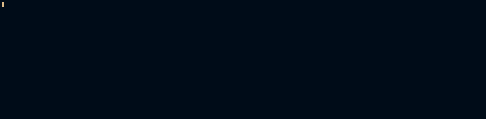

# Отримання доступу до ArgoCD Dashboard

## Встановлення k3d

Для встановлення k3d використовуйте офіційну документацію: https://k3d.io/v5.5.1/#installation

## Створення кластера

```bash
k3d cluster create testcluster
```



## Встановлення ArgoCD

```bash
kubectl create namespace argocd
kubectl apply -n argocd -f https://raw.githubusercontent.com/argoproj/argo-cd/stable/manifests/install.yaml
```


## Отримання паролю до ArgoCD Dashboard

```bash
kubectl -n argocd get secret argocd-initial-admin-secret -o jsonpath="{.data.password}" | base64 -d; echo
```


## Налаштування port-forwarding до ArgoCD Dashboard

```bash
kubectl port-forward svc/argocd-server -n argocd 8085:443
```

Тепер Dashboard ArgoCD доступний на вашій локальній машині за адресою: ```https://localhost:8085```

